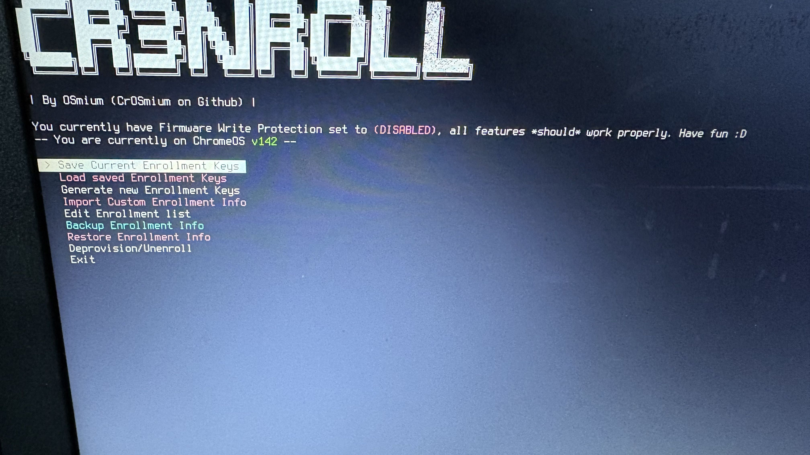

# Cr3nroll
Pronounciation: *(Cr-3-enroll)*, or *(Cr-enroll)* [ you pick! ]</br></br>

A general enrollment utility for ChromeOS</br>
I'm going to actively maintain this with the latest public unenrollment too, and be adding more features whenever I can.</br></br>
*THIS IS A STANDALONE UTILITY, AND DOES NOT INCLUDE A SHIM*

*an image of Cr3nroll running on R143 [within a MacOS terminal via flags]*
</br></br></br>

*an image of Cr3nroll running within SH1MMER on a chromebook*
</br>
</br>
# How to implement into another project :D
This is instructions on how to put Cr3nroll into something like Sh1mmer, and still keep Br0ker working!
## Step 1.
get Cr3nroll</br>
```
git clone https://github.com/crosmium/cr3nroll
```
## Step 2.
Put Cr3nroll into the project of your choice!
## (optional) Step 3. [Setup Br0ker]
Get the payload for br0ker and place it in the same directory as Cr3nroll
```
wget https://cdn.crosbreaker.dev/br0ker.sh
```
Using Sh1mmer or some other payloads folder and can't place it in there alongside Cr3nroll?</br>Just edit the flags at the top of `cr3nroll.sh` to be:
```
# -- CUSTOM FLAGS --
BROKER_PATH="broker.sh" # Put the exact path to your br0ker.sh in the quotes
```
## (optional) Step 4. [Enable Br0ker!]
Open `cr3nroll.sh` in the text editor of your choice and set this flag to true like this
```
BROKER_ENABLED="true"
```
----------
feel free to put this into any other project, as long as OSmium ([CrOSmium](https://github.com/CrOSmium/)) is properly credited (by leaving the unmodified credits in the script)
